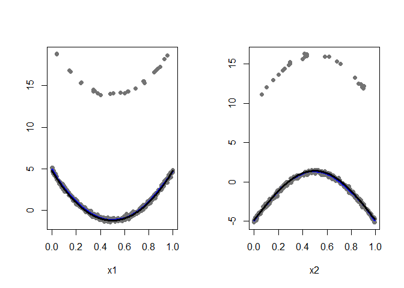

A marginal integration procedure
--------------------------------

This repository contains an <code>R</code> package with the classical and robust marginal integration procedures for estimating the additive components in an additive model, implementing the proposal of Graciela Boente and Alejandra Martinez in

> Boente G. and Martínez A. (2017). Marginal integration M−estimators for additive models. TEST, 26, 231-260.

The package can be install from <code>R</code> by using

``` r
library(devtools)
install_github("alemermartinez/RMI")
```

The following example corresponds to one of the 2-dimensional simulated samples considered in the paper.

Let begin by defining the additive functions and then generating the simulated sample.

``` r
library(RMI)

function.g1 <- function(x1) 24*(x1-1/2)^2-2
function.g2 <- function(x2) 2*pi*sin(pi*x2)-4

set.seed(140)
n <- 500
x1 <- runif(n)
x2 <- runif(n)
X <- cbind(x1, x2)
eps <- rnorm(n,0,sd=0.15)
regresion <- function.g1(x1) + function.g2(x2)
y <- regresion + eps
```

As it is explained in the paper, the bandwidths used for the direction of interest and for the nuisance direction might be different. For estimating the additive functions, bandwidths for the direction of interest and for the nuisance direction were considered equal to 0.1.

``` r
bandw <- rep(0.1,2)
```

Besides, for this estimation procedure, a different measure for approximating the integrals can be used. In this case, we will consider the following:

``` r
set.seed(9090)
Qmeasure <- matrix(runif(500*2), 500, 2)
```

Now we will use the robust marginal integration procedure to fit an additive model using the Huber loss function (with default tuning constant c=1.345), a linear fit (degree=1) for the estimation procedure at each additive component, a kernel of order 2 (orderkernel=2) and the type of estimation procedure which, in this case, focus the attention on each alpha additive component and not on all of them at the same time (type='alpha'). In addition, a specific point will be predicted.

``` r
point <- c(0.7, 0.6)
robust.fit <- margint.rob(Xp=X, yp=y, point=point, windows=bandw, epsilon=1e-10, degree=1,
                          type='alpha', orderkernel=2, typePhi='Huber', Qmeasure=Qmeasure)
```

The prediction and true values of the additive functions are:

``` r
robust.fit$prediction
```

    ##           [,1]     [,2]
    ## [1,] -1.009927 2.153329

``` r
c(function.g1(point[1]), function.g2(point[2]))
```

    ## [1] -1.040000  1.975664

The following figures plot the partial residuals, the estimated curve (in blue) and the true function (in black) for each additive function:

``` r
lim.rob <- matrix(0, 2, 2)
functions.g <- cbind(function.g1(X[,1]), function.g2(X[,2]))
par(mfrow=c(1,2))
for(j in 1:2) {
  res <- y - robust.fit$mu - robust.fit$g.matrix[,-j]
  lim.rob[,j] <- range(res)
  plot(X[,j], res, type='p', pch=19, col='gray45', xlab=colnames(X)[j], ylab='', cex=1, ylim=lim.rob[,j])
  ord <- order(X[,j])
  lines(X[ord,j], robust.fit$g.matrix[ord,j], lwd=3, col='blue')
  lines(X[ord,j], functions.g[ord,j], lwd=3)
}
```



Now, for estimating the derivatives, we will consider the bandwidth for the direction of interest as 0.15 while 0.2 for the nuisance direction. Same other arguments were set in the function.

``` r
htilde <- 0.2
halpha <- 0.15
bandw <- matrix(htilde,2,2)
diag(bandw) <- rep(halpha,2)

robust.fit2 <- margint.rob(Xp=X, yp=y, point=point, windows=bandw, epsilon=1e-10, degree=1, type='alpha',
                          orderkernel=2, typePhi='Huber', Qmeasure=Qmeasure, qderivate=TRUE)
```

The prediction and true values of the derivative additive functions are:

``` r
function.g1.prime <- function(x1) 24*2*(x1-1/2)
function.g2.prime <- function(x2) 2*pi^2*cos(pi*x2)

robust.fit2$prediction.derivate
```

    ##          [,1]      [,2]
    ## [1,] 10.42077 -8.042503

``` r
c(function.g1.prime(point[1]), function.g2.prime(point[2]))
```

    ## [1]  9.600000 -6.099751

The following figures plot the estimated (in blue) and true (in black) curves for each derivative additive function:

``` r
par(mfrow=c(1,2))
lim.rob <- matrix(0, 2, 2)
functions.g.prime <- cbind(function.g1.prime(X[,1]), function.g2.prime(X[,2]))
for(j in 1:2) {
  ord <- order(X[,j])
  lim.rob[,j] <- range(c(functions.g.prime[,j],robust.fit2$g.derivate[,j]))
  plot(X[ord,j], robust.fit2$g.derivate[ord,j], type='l', lwd=3, col='blue', xlab=colnames(X)[j],
      ylab='', cex=1, ylim=lim.rob[,j])
  lines(X[ord,j], functions.g.prime[ord,j], lwd=3)
}
```


